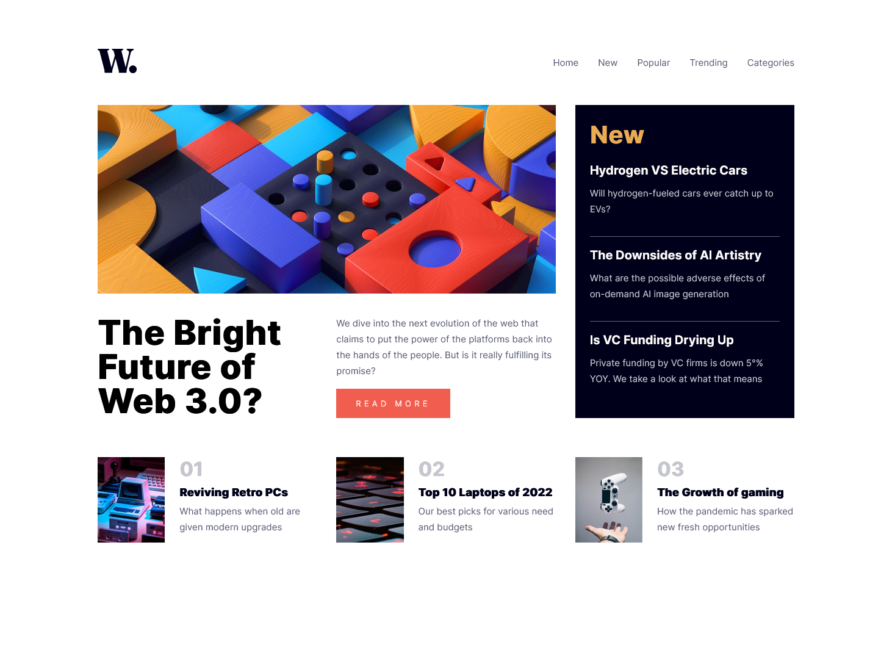

# Frontend Mentor - News homepage solution

This is a solution to the [News homepage challenge on Frontend Mentor](https://www.frontendmentor.io/challenges/news-homepage-H6SWTa1MFl). Frontend Mentor challenges help you improve your coding skills by building realistic projects. 

## Table of contents

- [Overview](#overview)
  - [The challenge](#the-challenge)
  - [Screenshot](#screenshot)
  - [Links](#links)
- [My process](#my-process)
  - [Difficulties](#difficulties)
  - [Built with](#built-with)
  - [What I learned](#what-i-learned)
  - [Continued development](#continued-development)
  - [Useful resources](#useful-resources)
- [Author](#author)
- [Acknowledgments](#acknowledgments)

## Overview

### The challenge

Users should be able to:

- View the optimal layout for the interface depending on their device's screen size
- See hover and focus states for all interactive elements on the page
- **Bonus**: Toggle the mobile menu (requires some JavaScript)

### Screenshot



### Links

- Solution URL: [https://github.com/Lordyner/news-homepage]
- Live Site URL: [https://lordyner.github.io/news-homepage/]

## My process

I started by analyzing the desktop and mobile layout. My main doubts were how to implement the hamburger menu for mobile and how to create the general layout. I created my react app with create-react-app and deleted everything that was useless. I created all the variables for the fonts, colors and breakpoints. I wanted to use css grid to create the general layout because it seems appropriate and also I've never used it before. After all the variables were created, I typed all the HTML contents of the page. Once the layout was done, I work more on the detail of the different sections. After that I work on the mobile layout. I moved the existing layout for the grid in a media queries for desktop and created a new grid layout for mobile.

### Difficulties
I couldn't get the layout perfectly right using css grid and the grid-template-columns. So I decided to use grid-template-areas which seems to me easier to use. Another difficulty was how to do the filter on the background when the side menu is open (mobile layout). I asked on a discord group I'm part of and people advice me to change the background-color in something darker and to add opacity. It didn't seem to be what's use on the model but that's the closest result that I could obtain.


### Built with

- Semantic HTML5 markup
- CSS custom properties
- Flexbox
- CSS Grid
- Mobile-first workflow
- [React](https://reactjs.org/) - JS library

### What I learned

I learned how to use css grid (and the grid-template-areas) and how to do a burger menu that transform into a classic navbar depending on the screen resolution of the user

```css
@media (min-width: $desktop) {
    grid-template-areas:
      'navbar navbar navbar'
      'mainImage mainImage newSection'
      'mainTitle mainText newSection'
      'navBot1 navBot2 navBot3';
  }
```
```js
const handleMenuDisplay = () => {
    setScreenWidth(window.screen.width);
    screenWidth > mobileResolution ? setIsDesktopResolution(true) : setIsDesktopResolution(false);
  }
```

### Continued development

I want to keep on working with css grid and be more competent with it.

### Useful resources

- [https://www.youtube.com/watch?v=rg7Fvvl3taU] - Great video on css grid by Kevin Powell
- [https://css-tricks.com/snippets/css/complete-guide-grid/] - Cheat sheet on css grid.

## Author

- Frontend Mentor - [@https://www.frontendmentor.io/profile/Lordyner]
- Github - [https://github.com/Lordyner]

## Acknowledgments

Thanks to the discord server named "Dev'Area" for helping with a css problem I had with when my side menu was displayed.
